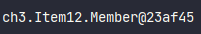

# Item12. toString을 항상 재정의하라
일반적으로 객체를 출력하면 대부분 객체의 참조값이 나옵니다.
```java
public class ToStringSample{
    public static void main(String[]args){
        Member member = new Member("Kim", 20);
        System.out.println(member);
    }
}
```
  
이런 정보들은 사람들에게 딱히 중요한 정보가 아닙니다. 중요한 것은 이 객체가 어떠한 정보를 가지고 있느냐죠!
`toString()`의 재정의는 여기서 출발합니다. 이 메서드를 재정의함으로서 객체 식별과 디버그가 극단적으로 좋아집니다.
단적인 예로 방금 예시에서 든 `println`, `printf`출력 메서드들과, 문자열 연결 연산자(`+`), 그리고 assert 구문을 넘길 떄
추가로, 디버거가 객체를 출력할때 자동으로 `toString()`을 호출합니다.

## 재정의 팁
우선 그 객체가 가진 주요 정보들은 모두 반환하는 것이 좋습니다.
```java
public class Member {
    private String name;
    private int age;

    @Override
    public String toString() {
        return "이름: " + name + ", 나이: " + age;
    }
}
```


