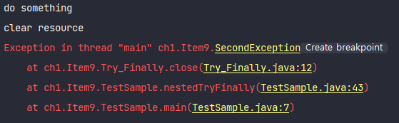
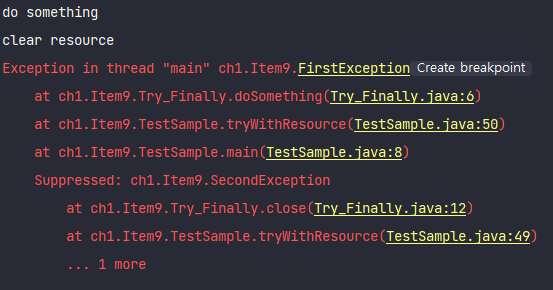
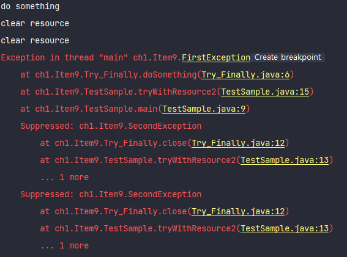

# Item9. try-finally 보다는 try-with-resources 를 사용하라
전통적으로 트랜잭션의 예외처리 방법은 try-finally를 사용했습니다. 가령 이러한 코드가 있다고 합시다.
```java
public class Try_Finally {
    // Throw FirstException
    public void doSomething() {
        System.out.println("do something");
        throw new FirstException();
    }

    // Throw SecondException
    @Override
    public void close() throws Exception {
        System.out.println("clear resource");
        throw new SecondException();
    }
}
```
우리의 목적은 실행(`doSomething()`) 후 자원을 반납(`close()`)을 하는 것입니다. 음... 이렇게 하면 어떨까요?
```java
public class TestSample {
    public static void main(String[] args) {
        Try_Finally resource = new Try_Finally();
        resource.doSomething();
        resource.close();
    }
}
```
* 결과  
[try-finally_1](./img/1.png)  

당연하지만 `doSomething()`가 던지는 예외때문에 `close()`가 작동하지 않습니다! 그래서 Try-Finally가 필요하게 되었죠.
이를 통해 안전하게 자원 반납까지 가능하게 됩니다!
```java
public class TestSample {
    public static void main(String[] args) {
        Try_Finally resource = null;
        try {
            resource = new Try_Finally();
            resource.doSomething();     // FirstException
        } finally {
            if (resource != null) {
                resource.close();       // SecondException
            }
        }
    }
}
```
* 결과  
[try-finally_2](./img/2.png) 

## 일반적인 Try-Finally의 문제
### 1. 하나의 예외만 보여준다.
훨씬 좋네요! 그런데 궁금증이 하나 생깁니다. 최초로 일어난 익셉션은 `doSomething`으로부터 발생된 `FirstException`인데.. 왜 결과에서는 `SecondException`
만 발생하는 걸까요? 두개를 모두 보여주면 안되는 걸까요?

### 2. 코드의 장황함
두번째로는 중첩된 Try-Finally문을 만들어봅시다.
```java
public class Try_Finally {
    public static void tryfinally() throws Exception {
        MyResource myResource = null;
        try {
            myResource = new MyResource();
            myResource.doSomething();
            MyResource myResource1 = null;
            try {
                myResource1 = new MyResource();
                myResource1.doSomething();
            } finally {
                if (myResource1 != null) {
                    myResource1.close();        // 이 secondError가 firstError를 덮어 쓰게 된다.
                }
            }
        } finally {
            if (myResource != null) {
                myResource.close();
            }
        }
    }
}
```
외적으로만 봤을때도 일단 코드가 너무 장황합니다. 만약 이 코드를 만든사람이 아니라면 한번에 이 코드의 실행 의도를 파악하기 어렵습니다.
* 결과  
  

## Try-With-Resource
위의 두 문제점을 해결하기 위해 `Try-With-Resource`가 탄생하게 되었습니다.
```java
public class TestSample {
    public static void main(String[] args) {
        try(Try_Finally resource = new Try_Finally()){
            resource.doSomething();
        }
    }
}
```
`try()` 안에 실행할 객체를 생성하는 코드만 넣으면 알아서 `close()`까지 모두 진행해 줍니다! (`AutoCloseable`를 구현해야 한다.) 더 좋은점은
**발생한 예외를 모두 보여준다는 것입니다!**
  
이러한 장점들로 압도적인 디버깅 효율을 보여줍니다!

### Plus. Try-With-Resource 중첩
여러 객체들을 사용하고 닫고 싶으면 `try()` 안에서 여러 객체를 생성하고, 이를 사용하면 됩니다.
```java
public class TestSample {
    public static void main(String[] args) {
        try (Try_Finally resource = new Try_Finally();
             Try_Finally resource2 = new Try_Finally()) {
            resource.doSomething();
            resource2.doSomething();
        }
    }
}
```
  
모든 객체를 닫아주는 모습을 확인할 수 있습니다.