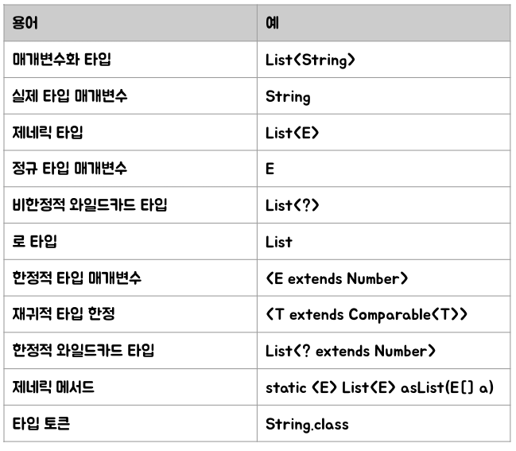

# Item26. 로 타입은 사용하지 마라.
## 용어 정리

### 제네릭 클래스 or 인터페이스
클래스와 인터페이스 선언에 타입 매개변수가 쓰이는 것을 말합니다.  
`class className<Type>` or `interface interfaceName<Type>`  
이 제네릭 클래스와, 제네릭 인터페이스를 통틀어 제네릭 타입이라고 합니다.  

### 매개변수화 타입
각각의 제네릭 타입은 일련의 **매개변수화 타입**을 정의합니다. 앞서 말한 제네릭 클래스와 인터페이스 선언을 참고하면..
`List<String> list = new ArrayList;`는 원소의 타입이 String인 리스트를 뜻하는 매개변수화 타입입니다.
이때 String을 정규타입 매개변수 E에 해당하는 실제 타입 매개변수 입니다.

### 로 타입
제네릭 타입을 하나 정의하면 그에 딸린 로 타입도 함께 정의됩니다. **로 타입이란 타입 매개변수를 전혀 사용하지 않을 때**를 말합니다.
`List member = ...;` 이 형태가 바로 제네릭이 만들어지기 전 사용했던 형태입니다.
다른 타입이 들어가도 컴파일러가 잡아내지 못하기 때문에 절대 이 패턴을 사용하시면 안됩니다! 그런데도 왜 이 타입이 선언되었냐 하면
아직까지는 제네릭이 등장하기 전의 코드를 정상적으로 작동시켜야 하기 때문에 **호환성 측면**에서 자동으로 선언하게 되었습니다. 
(그렇다고 사용하시면 안됩니다!)

### 와일드 카드
제네릭 타입 코드에서 와일드 카드라고 하는 물음표`?`는 알 수 없는 유형을 나타냅니다.
와일드 카드는 파라미터 변수, 필드 도는 지역변수의 타입 등 다양한 상황에서 사용할 수 있습니다.
와일드 카드는 **제네릭 메서드 호출, 제네릭 클래스 인스턴스 생성 또는 수퍼타입의 타입 인자로는 사용할 수 없습니다.**
***

## 제네릭의 이점
제네릭의 가장 강력한 이점이라고 하면 해당 객체에 설정한 타입을 제외한 타입들이 들어가면 컴파일러가 잡아준다는 것 입니다!
`private final Collection<Member> members = ...;` 이 members에서는 `Member` 객체를 제외한 다른 객체가 들어간다면
컴파일러 오류가 발생하고 무엇지 잘못되었는지를 정확히 알려줍니다.


## 비한정적 와일드카드 타입
때때로는 **제네릭 객체를 정확하게 정하지 못할 경우**가 있습니다. 고민을 하다 "Object는 모든 타입의 슈퍼클래스다"를 떠올리고 이 코드를 짜봅니다.
```java
public class RowTypeAndWildCard {
    public static void main(String[] args) {
        List<String> strings = List.of("Hello", "Unbounded", "Wildcards!");
        List<Integer> integers = List.of(1, 2, 3, 4, 5);
        printList(strings);
        printList(integers);
    }

    private static void printList(List<Object> list) {
        System.out.println(list);
    }
}
```
하지만 결과는? Object 타입만 허용이 되는 기이한 상황이 벌어집니다. 이런 경우에는 그냥 로 타입이 그리워집니다.
여러분의 로 타입 향수병을 방지하기 위해서 자바에서는 **비한정적 와일드카드 타입을 제공**합니다.  
비한정적 와일드카드 타입은 **제네릭 타입을 사용하고 싶으나, 실제 타입 매개변수가 무엇인지 신경 쓰고 싶지 않을 경우에 사용하는 방법**입니다.
정확하게 말하자면...
* **Object class에서 제공하는 기능만을 사용하여 구현**할 수 있는 메서드를 작성하는 경우
* **매개 변수 타입에 의존하지 않는 제네릭 클래스 메서드를 사용**하는 경우. (List.size(), List.clear())

이 경우에만 사용합니다.
사용법은 간단합니다. `<?>`를 입력하시면 됩니다! 이를 통해 **어떤 타입이라도 담을 수 있는 가장 범용적인 매개변수화 타입**이 되었습니다!

### 비한정적 와일드카드 타입 VS 로 타입
여기서 의문점이 생깁니다. "아니 비한정적 와일드카드 타입이 하는 일이나 로 타입이 하는 일이나 다른게 뭐야?" 합리적인 의심입니다! 하지만 조금 다릅니다.
**로 타입은 아무 원소나 넣을 수 있기 때문에 타입 불변식을 훼손하기 쉽습니다.**
하지만, **비한정적 와일드카드는 null 외에는 어떤 원소도 넣을 수 없습니다.** 다른 원소를 넣으려 하면 컴파일러가 오류로 잡아냅니다! 